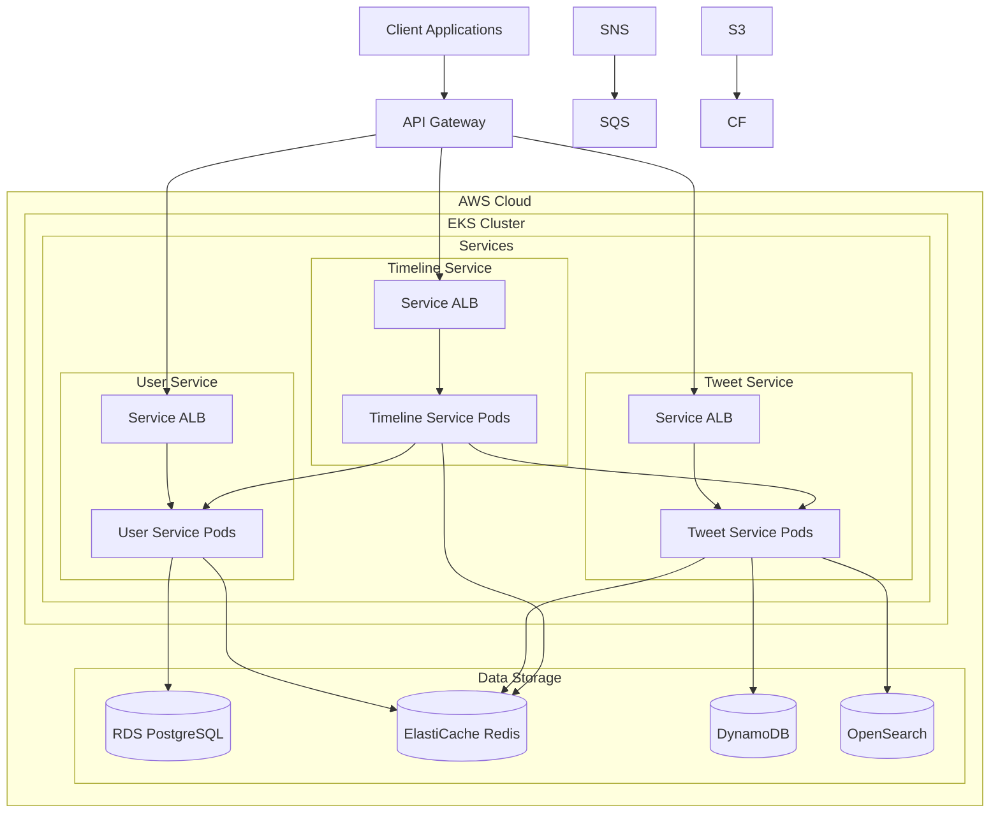
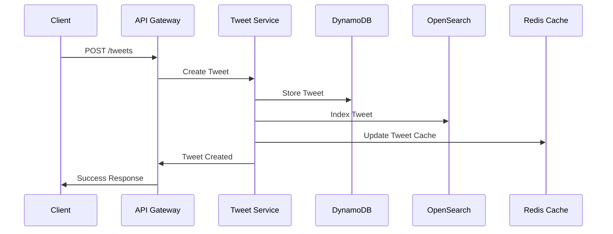
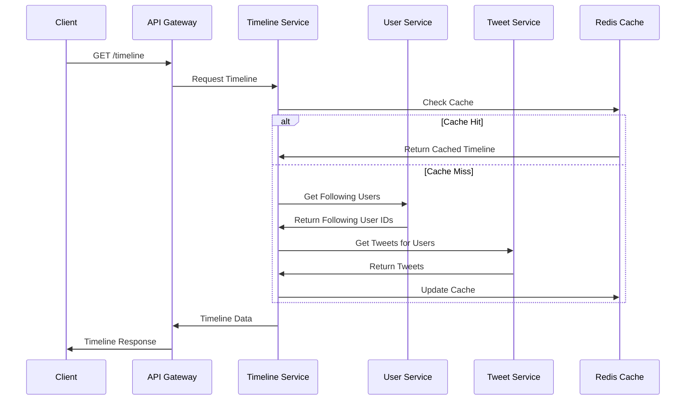
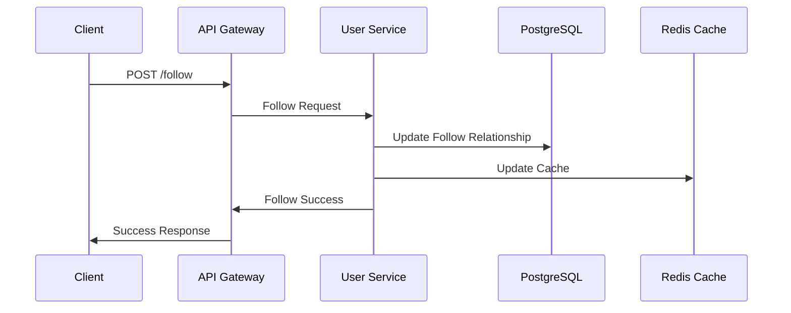
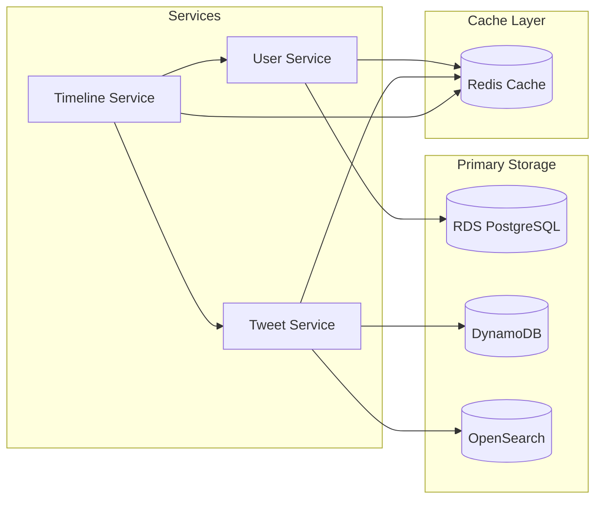

# Architecture Diagrams

## System Architecture Overview

```mermaid
graph TB
    Client[Client Applications]
    AG[API Gateway]
    
    subgraph AWS Cloud
        subgraph EKS Cluster
            subgraph Services
                subgraph User Service
                    USALB[Service ALB]
                    US[User Service Pods]
                end
                
                subgraph Tweet Service
                    TSALB[Service ALB]
                    TS[Tweet Service Pods]
                end
                
                subgraph Timeline Service
                    TLSALB[Service ALB]
                    TLS[Timeline Service Pods]
                end
            end
        end
        
        subgraph Data Storage
            RDS[(RDS PostgreSQL)]
            REDIS[(ElastiCache Redis)]
            DDB[(DynamoDB)]
            OS[(OpenSearch)]
        end
        
    end
    
    Client --> AG
    AG --> USALB & TSALB & TLSALB
    
    USALB --> US
    TSALB --> TS
    TLSALB --> TLS
    
    US --> RDS
    US --> REDIS
    
    TS --> DDB
    TS --> REDIS
    TS --> OS
    
    TLS --> US
    TLS --> TS
    TLS --> REDIS
    
    SNS --> SQS
    
    S3 --> CF
```

## Service Interaction - Tweet Creation Flow

```mermaid
sequenceDiagram
    participant C as Client
    participant AG as API Gateway
    participant TS as Tweet Service
    participant DDB as DynamoDB
    participant OS as OpenSearch
    participant R as Redis Cache

    C->>AG: POST /tweets
    AG->>TS: Create Tweet
    TS->>DDB: Store Tweet
    TS->>OS: Index Tweet
    TS->>R: Update Tweet Cache
    TS->>AG: Tweet Created
    AG->>C: Success Response
```

## Timeline Retrieval Flow

```mermaid
sequenceDiagram
    participant C as Client
    participant AG as API Gateway
    participant TLS as Timeline Service
    participant US as User Service
    participant TS as Tweet Service
    participant R as Redis Cache

    C->>AG: GET /timeline
    AG->>TLS: Request Timeline
    TLS->>R: Check Cache
    alt Cache Hit
        R->>TLS: Return Cached Timeline
    else Cache Miss
        TLS->>US: Get Following Users
        US->>TLS: Return Following User IDs
        TLS->>TS: Get Tweets for Users
        TS->>TLS: Return Tweets
        TLS->>R: Update Cache
    end
    TLS->>AG: Timeline Data
    AG->>C: Timeline Response
```

## User Service Flow

```mermaid
sequenceDiagram
    participant C as Client
    participant AG as API Gateway
    participant US as User Service
    participant RDS as PostgreSQL
    participant R as Redis Cache

    C->>AG: POST /follow
    AG->>US: Follow Request
    US->>RDS: Update Follow Relationship
    US->>R: Update Cache
    US->>AG: Follow Success
    AG->>C: Success Response
```

## Data Storage Architecture

```mermaid
graph LR
    subgraph Primary Storage
        RDS[(RDS PostgreSQL)]
        DDB[(DynamoDB)]
        OS[(OpenSearch)]
    end
    
    subgraph Cache Layer
        RC[(Redis Cache)]
    end
    
    subgraph Services
        US[User Service]
        TS[Tweet Service]
        TLS[Timeline Service]
    end
    
    US --> RDS
    US --> RC
    
    TS --> DDB
    TS --> RC
    TS --> OS
    
    TLS --> US
    TLS --> TS
    TLS --> RC
```
